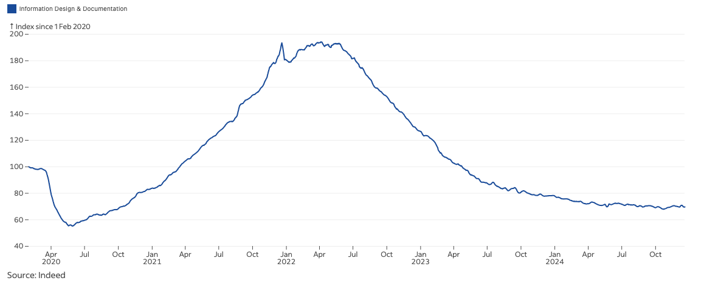

Yes, you're reading this correctly.

Over my career as a technical writer, I've read countless articles about why you should pursue this profession. Conferences buzz with enthusiasm about the growing demand and success stories. Technical writers eagerly share why they love their craft. But there's a conspicuous silence about the other side of the coin.

You might be asking, “Why would I want to read reasons not to pursue this career in the first chapter of the book?” Simple: I believe you deserve to know the unvarnished truth before committing to this path. When I started, no one sat me down and had this conversation. I learned these lessons the hard way, through what I can only describe as a tortuous path of trial and error, frustration, and eventual adaptation.

This isn't meant to discourage you. Rather, I want you to fully understand what you're signing up for. So here's the thing — if after reading these points, you still find yourself thinking, "I can handle that", or better yet, "That actually sounds interesting", you're likely to not just survive, but thrive as a technical writer.

---

## The technical knowledge mountain

Imagine trying to learn a new language where the vocabulary changes every few months, the grammar rules are written in code, and you need to understand quantum physics just to say "hello world". That's what stepping into technical writing often feels like for newcomers.

Many technical writers come from non-technical backgrounds — journalists, marketers, translators, even teachers. They might have strong writing skills, but when it comes to technical content, they often need to teach themselves complex concepts and technologies. Essentially, this is a perpetual student role, where your "homework" directly impacts product usability and user experience.

For general consumer-facing products, you might get by with a surface-level understanding. However, as you dive into the deep end, like open-source projects or developer tools, the challenge grows exponentially.

Writing about these topics often requires knowledge across multiple technical domains. In software, for example, it may involve AI models, databases, middleware, storage systems, operating systems, coding languages, and APIs. Knowing just a little bit about a topic isn't nearly enough. As a technical writer, you need a much deeper understanding.

Additionally, theoretical knowledge isn't always enough. You'll spend countless hours in hands-on testing – setting up development environments, installing dependencies, troubleshooting failed builds, and validating entire workflows. What takes a developer minutes might take you hours or even days to understand fully enough to document.

None of these is an easy task. Even experienced developers can struggle. For technical writers, this learning curve can be particularly steep and unforgiving. Many enthusiastic beginners face this reality and retreat to more comfortable territory. Those who persist often find themselves limited to basic editing of developer-written drafts or product manager specifications.

Therefore, you need to be prepared for the reality: becoming a technical writer means committing to a lifetime of learning, often at a pace that can feel overwhelming. If you're not ready for that commitment, this might be your first red flag.

## The invisible and forgotten team member

Picture this: It's 11:45 PM on a Thursday. The product launches tomorrow at 9 AM. Suddenly, your Slack lights up: "Hey, we need the documentation ready for tomorrow's release. The API endpoints changed last week. Can you update everything by morning?"

Welcome to the life of a technical writer, where you're simultaneously essential and invisible.

In some companies, documentation is often treated like a last-minute afterthought. It is squeezed into the narrow gap between product completion and release deadlines. Some may argue that this makes logical sense. After all, you can't document features that aren't finalized. But what this means for you, as a technical writer, is that you're often the **last** to be considered and the **last** to get the information you need. As a result, you'll frequently find yourself working under tight deadlines.

This can lead to a deep sense of isolation. **No one** outside of the technical writing team truly understands what you do. To your colleagues, such as engineers and product managers, you're just the person who “polishes” the drafts they provide, making sure everything looks good. They'll often view your role as more about editing and formatting than creating valuable content from scratch.

Even when you're putting in the hard work, you'll find your efforts are easily overlooked. Once you finish drafts and send them out for review, you may have to wait for a long time for feedback. Your reviewers, often deep in their own work, might ignore your requests until the very last minute.

The reality is both ironic and frustrating:

- You're expected to produce high-quality documentation with minimal time
- Your work is critical for product adoption, yet treated as an afterthought
- You need input from subject matter experts who are always "too busy"
- Your role is essential for user success, yet often undervalued by the team

Let me share an example from my own experience. I once wrote a document that needed a developer's review. Despite repeated follow-ups, **six months** passed without a response. Finally, in the seventh month, the developer left the company. When I contacted him later, he didn't even recognize my name or know what I did. This might be rare, but it did happen.

Even outside of work, explaining your profession becomes an exercise in patience. "*What exactly do you do at work?*" people ask, with their eyes already glazing over. After explaining it a few times, you'll likely realize that it's easier to just say, *“I write manuals,”* and leave it at that. You'll become known as the “manual-writing guy”, which isn't the worst thing, but it's not exactly a title that inspires awe.

Being a technical writer often means working in the shadows, largely unnoticed, and sometimes even undervalued. It's a role that requires patience, resilience, and a thick skin to keep moving forward. If you're someone who needs regular recognition to stay motivated, this aspect of technical writing might be particularly challenging.

## The solo journey

Unlike other teams, technical writing teams – if you can even call them "teams" – are often remarkably small. This is especially true in small to medium-sized companies, where the product lines are fewer, and the focus remains on core product development.

In fact, a small documentation team makes perfect business sense. The general idea is that a good, well-designed product should be intuitive enough that it doesn't need extensive instructions. It speaks for itself. This philosophy leads many companies to reduce their focus on documentation or, at best, keep it to a bare minimum.

For many organizations, this means **there's often no “doc team” at all.** It's just you, working alone. You'll be the one writing, editing, and maintaining all the technical content. This solo journey can be particularly challenging if you:

- Thrive on team dynamics and daily collaboration
- Need regular peer feedback on your work
- Enjoy the energy of working in larger groups
- Want a clear career progression path within a team structure

However, being alone doesn't mean you're unsupported. You can still collaborate with other members from other teams to gather information, review content, and ensure accuracy. Developers, product managers, and testers will still be your go-to sources for insights, feedback, and clarification. But in the end, you'll likely find yourself responsible for organizing and producing the final content.

## The AI writing wave

It's impossible to ignore the growing influence of AI in almost every field. Technical writing is no exception. It's a valid concern that keeps many technical writers awake at night: "Can AI like ChatGPT replace me?”

At first glance, the idea seems compelling. Feed a prompt into an AI model, and within seconds, you get a fully formed document. While it may not be perfect, it's much faster than a human writer. This efficiency puts human technical writers in direct competition with technology that only seems to improve by the day. Over the past two years, many companies have downsized or eliminated technical writing positions.

So, why do you want to continue dedicating your time and energy to a profession that seems increasingly vulnerable to automation? 

This is a complicated topic that deserves its own discussion. My answer here is simple: **Yes, AI is impacting the technical writing field, but that doesn't mean the profession is disappearing. Instead, it's evolving.** Instead of being replaced by AI, successful technical writers are learning to leverage AI as a tool in their arsenal. For example, they're using AI to:

- Generate initial drafts for basic content
- Brainstorm structure and outline ideas
- Rewrite content for different audience levels
- Spot inconsistencies in existing documentation
- Create code examples and test cases

**The real challenge isn't AI replacing technical writers; it's technical writers who use AI replacing those who don't**. The profession is transforming from pure content creation to content curation, validation, and strategic documentation planning.

If you want to stay ahead of this trend, you'll need to continuously evolve your skills and demonstrate value that AI can't easily replicate. But make no mistake: AI is here, and it will change the landscape of technical writing forever.

## The endless revision cycle

Unlike those who never respond to your review requests, some reviewers may provide an avalanche of feedback. This means more revisions, and it won't take long for you to realize that revision is a constant, sometimes exhausting part of your job.

You might wonder: *Why is revision such a big deal? Isn't it just about making changes based on feedback?* Not exactly. Here's what really happens:

- Someone suddenly appears with extensive feedback just when you thought the document was final
- Multiple experts provide conflicting feedback, leaving you to referee debates
- Last-minute reviewers frequently request major structural changes after multiple approval rounds
- Confident reviewers question your writing style while introducing errors into your carefully crafted document
- Careless reviewers insist you've missed crucial information that's actually clearly stated in your document
- Well-meaning stakeholders suggest changes that would actually make the documentation less clear, not more
- Your document goes through an exhausting marathon of **20 or 30 rounds of revisions** by dozens of people, with each round bringing new perspectives and challenges

All of these can make the revision process time-consuming and unpredictable. It discourages you and leaves you feeling like you'll never get the document to a “final” state.

If you're someone who loves ticking things off as “done” and moving on, the revision process might drive you crazy.

## The language prison

Unlike creative or marketing content, technical writing is often dry, repetitive, and boring. This is because technical language follows strict rules and has a very specific tone. The goal is never to entertain but to inform and instruct in the clearest, most straightforward way possible.

You'll need to embrace a set of precisely defined rules and adhere to them religiously. Your writing vocabulary will shrink to a carefully curated set of clear, unambiguous terms. Words like "install," "configure," "validate," and "execute" will become your constant companions.

Over time, your relationship with language transforms. Grammar, clarity, and precise word choice aren't just goals – they become obsessions. The grammatical perfectionism seeps into your DNA until you find yourself:

- Mentally editing restaurant menus while trying to enjoy dinner with friends
- Spotting typos in street signs during your morning commute
- Waking up at 3 AM in a cold sweat, wondering if you should have used "which" or "that"
- Maintaining an ever-growing collection of style guides, commonly confused terms, and grammar references

This obsession often leads to nitpicking over the smallest details. Over time, it can turn you into a person who can't help but mentally edit everything they read. This can be soul-crushing for those who:

- Love creative writing
- Enjoy playing with language and metaphors
- Have a distinctive writing voice you want to use
- Get bored with repetitive language patterns
- Find joy in clever wordplay and varied expression

Think about it: Are you ready to trade linguistic creativity for technical precision? Can you find satisfaction in writing that prioritizes clarity over style? Are you prepared to follow rigid language and grammar rules day after day?

## The "write-it-all" expectation

Honestly speaking, this might not be an issue in large organisations where roles are clearly defined. However, if you are working in a smaller organisation or a startup, it's likely to be a different story altogether.

The assumption is simple: if you can write technical documentation, surely you can write anything else in English, right? Additionally, these organisations typically don't have the luxury of hiring dedicated specialists for every type of content. As a result, you'll often become the go-to person for all written content. Your inbox might suddenly fill with requests to write or review:

- Website content (including English and localisation copies)
- Internal and external marketing materials
- Company newsletters and blog posts
- Employee handbooks and onboarding materials
- Corporate policies and procedures
- Training video scripts (even record/edit the video yourself)
- Social media content
- Press releases and company announcements

This is especially common if you're working in a non-English speaking company. You might find yourself being the default English language expert. All materials in English might pass through you at some stage.

What this means is that you'll often be overloaded with extra work beyond your primary role. You'll also need to develop additional writing skills to accommodate different writing styles and formats.

Some may argue that this can make the role more interesting and provide valuable experience across different writing styles. Nevertheless, it can also lead to burnout if you're not prepared for the additional responsibilities. Make sure you understand what you're signing up for, especially in smaller organisations.

## The limited career ladder

Picture yourself at a career crossroads ten years into technical writing. Your title? Still "Technical Writer" – perhaps with "Senior" added if you're lucky. The career path in technical writing often resembles a short corridor rather than a climbing wall, and this reality catches many by surprise.

Why is this the case?

First, job security. Technical writing positions are often seen as overhead rather than revenue-generating roles, making them vulnerable to:

- Budget cuts and "reorganisations"
- Outsourcing initiatives
- Headcount reductions
- The dreaded "we're streamlining our documentation process" announcement

When companies need to trim costs, documentation teams often find themselves on the chopping block first. The rationale? "The product should be intuitive enough" or "The developers can write the docs". It doesn't matter how excellent your work has been. Sometimes it's simply a numbers game.

Then there's the career progression challenge. Technical writing typically offers a surprisingly flat career trajectory:

- Technical Writer
- Senior Technical Writer
- Lead Technical Writer (if you're fortunate)
- Documentation Manager (if there's a large enough team)

And that's often it, **unless you develop other skills**. If you're looking for a career with clear advancement opportunities, technical writing may not be the best fit.

---

Now, after reading through these sobering realities, are you feeling a bit afraid? Good. You should be. **And here's the encouraging part: I have answers and solutions to all of them**. This is exactly why I'm writing this book. Each obstacle I've described can be overcome with the right strategies, mindset, and tools.

If you're still here, still interested, and ready to learn how to tackle these challenges head-on, then turn the page.