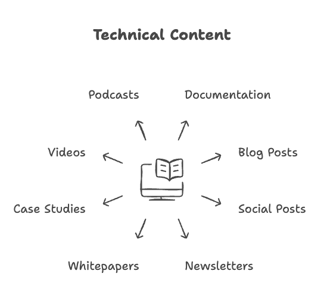

Before diving into the details of technical content creation, it’s important to understand what "technical content" means. While the term may vary across industries, but the general concept is consistent. In the context of the software industry, it refers to the materials that help users understand and effectively use a product or service.

## Overview

At its core, technical content is about explanation and guidance. When creating technical content, you’re:

- Explaining what a product or service does
- Describing various features and their benefits
- Guiding users through the complete lifecycle of using the product
- Helping users achieve their goals efficiently

For example, the documentation for a developer-facing tool might guide users through:

1. **Introduction**: A high-level summary of the product and its purpose.
2. **Setup and installation**: Step-by-step instructions to set up the tool.
3. **Usage and features**: Detailed explanations of functionalities and use cases.
4. **Configuration and customization**: Guidance on adapting the product to specific needs.
5. **Best practices and troubleshooting**: Advice to optimize usage and resolve common issues.
6. **Reference**: Comprehensive details like UI properties, API documentation, command-line options, configuration parameters, and other specifications that users can quickly look up.

## Types of technical content

Although traditional documentation is a cornerstone of technical content, it extends to various other formats to meet user needs:

- Blog Posts
- Social Posts
- Newsletters
- Whitepapers/E-books
- Case Studies/Customer Success Stories
- Videos
- Podcasts

## The technical content process

Creating technical content is a structured process involving multiple stages:

- **Planning:** Determine purpose, scope, structure, audience, and deliverables
- **Research:** Understand the product, its features, competitors, and user needs
- **Drafting:** Create clear and accurate content based on gathered information
- **Review**: Have the content reviewed by subject matter experts and stakeholders
- **Feedback implementation**: Incorporate feedback and suggestions to improve the content
- **Publishing:** Make the content accessible to users through suitable platforms (e.g., online, PDFs, or multimedia)
- **Maintenance:** Regularly update the content to reflect product changes and ensure continued relevance